<!DOCTYPE html>
<html lang="en">

<meta http-equiv="content-type" content="text/html;charset=UTF-8" />
<head>
    <meta charset="utf-8">
    <meta name="description" content="I am an experienced ICT professional with database administration skills across MySQL, ability to Create stand alone Desktop applications developing websites, configuration and maintenance of computer based information systems, as well as having an eye for detail and able to multi-task under pressure.">
    <meta name="keywords" content="Hackers, Free webiste, hacking, developers, cheap developers, free, tanzania developers, freelancers, jobs, webite, free websites, free data, free tools, cracked softwares">
	<meta name="image" content="user.jpg">
	<meta name="author" content="Ally Mussa Ndimbo">
    <meta http-equiv="x-ua-compatible" content="ie=edge">
    <meta name="viewport" content="width=device-width, initial-scale=1">

    <!-- Title -->
    <title>Ally Mussa Ndimbo</title>
    <!-- Favicon -->
    <link href="img/user.jpg" type="image/png" rel="icon">

    <!-- All CSS -->
    <link href="css/plugins.css" rel="stylesheet" type="text/css">
    <link href="css/main.css" rel="stylesheet" type="text/css">
    <link href="css/responsive.css" rel="stylesheet" type="text/css">
</head>

<body id="body" data-spy="scroll" data-target="#menu-list">

	<!--  start page loader  -->
	

		

	

	<!--  end page loader  -->

    <!-- begin of main-wrapper -->
    

		<!-- begin of navbar -->
		

			<!-- begin of scroll-indicator -->
			

			<nav>
				<ul id="menu-list">
					<li class="nav-item"><a class="active nav-link" href="#body" data-text="Home">
						01Home
					</a></li>
					<li class="nav-item"><a class="nav-link" href="#about" data-text="About">
						02About
					</a></li>
					<li class="nav-item"><a class="nav-link" href="#services" data-text="Services">
						03Services
					</a></li>
					<li class="nav-item"><a class="nav-link" href="#skills" data-text="Skills">
						04Skills
					</a></li>
					<li class="nav-item"><a class="nav-link" href="#education" data-text="Education">
						05Education
					</a></li>
					<li class="nav-item"><a class="nav-link" href="#experience" data-text="Experience">
						06Experience
					</a></li>
					<li class="nav-item"><a class="nav-link" href="#works" data-text="Projects">
						07Projects
					</a></li>
					<li class="nav-item"><a class="nav-link" href="#contact" data-text="Contact">
						08Contact
					</a></li>
				</ul>
			</nav>
			

				
&copy; Copyright All rights reserved

			

		

		<!-- end of navbar -->
		<!-- begin of main-content -->
		

			<!-- begin of header -->
			<header>
				

					

						

							<!-- logo -->
							

								<a href="index.html">Ally Mussa Ndimbo</a>
							

						

						

							<a href="#" class="default-btn header-action-btn"><i class="ti-agenda"></i> Download CV</a>
							

								<i class="ti-menu"></i>
								<i class="ti-close"></i>
							

						

					

				

			</header>
			<!-- end of header -->

			<!-- begin of home-wrapper -->
			

				

					

						

							

								

								<!-- hero image -->
								
							

						

						

							

								<h2 class="intro-name">
									Hey, I am
									Ally Ndimbo
								</h2>
								

									Full stack Developer & Cybersecurity Expert. Based in Tanzania.
								

							

						

					

				

			

			<!-- end of home-wrapper -->

			<!-- begin of about-wrapper -->
			

				

					

						

							<!-- section heading -->
							<h3 class="wrapper-heading">About Me</h3>

							<h4 class="about-sub-heading">My name is Ally. I am a Full stack Developer & Cybersecurity Expert and lives in Tanzania.</h4>
							
Also an experienced ICT professional with database administration skills across MySQL, ability to Create stand alone Desktop applications developing websites, configuration and maintenance of computer based information systems, as well as having an eye for detail and able to multi-task under pressure.
								 
								 
								Also an excellent communicator, can relate well with people at all levels and has the flexibility of working well as part of a team and on my ownI am an experienced ICT professional with database administration skills across MySQL, ability to Create stand alone Desktop applications developing websites, configuration and maintenance of computer based information systems, as well as having an eye for detail and able to multi-task under pressure.
								 
								 
								Also an excellent communicator, can relate well with people at all levels and has the flexibility of working well as part of a team and on my own.

							<a href="#" class="default-btn"><i class="ti-agenda"></i> Download CV</a>

							<!-- social profile links -->
							

								I am avilable on
								<ul>
									<li><a href="https://twitter.com/ally_ndimbo" data-text="tw"><i class="ti-twitter"></i></a></li>
									<li><a href="https://instagram.com/ally_ndimbo" data-text="ig"><i class="ti-instagram"></i></a></li>
									<li><a href="https://www.linkedin.com/in/ally-ndimbo-806632127/" data-text="in"><i class="ti-linkedin"></i></a></li>
									<li><a href="#" data-text="fa"><i class="ti-facebook"></i></a></li>
									<li><a href="https://wa.me/+255684049052" data-text="fa"><i class="ti-whatsapp"></i></a></li>

								</ul>
							

						

					

				

			

			<!-- end of about-wrapper -->

			<!-- begin of service-wrapper -->
			

				

					

						

							<!-- section heading -->
							<h3 class="wrapper-heading">Services</h3>
						

						

							<!-- service item -->
							

								
								<h4>UI/UX Design</h4>
								

							

						

						

							<!-- service item -->
							

								
								<h4>Branding</h4>
								

							

						

						

							<!-- service item -->
							

								
								<h4>Testing</h4>
								

							

						

						

							<!-- service item -->
							

								
								<h4>IT Support</h4>
								

							

						

						

							<!-- service item -->
							

								
								<h4>Web Design</h4>
								
Full stack web designer and Developer

							

						

						

							<!-- service item -->
							

								
								<h4>Custom Software Development</h4>
								
I Develop custom softwares based on the client needs and specifications

							

						

						

							<!-- service item -->
							

								
								<h4>Malware analysis</h4>
								
I analyse computers on the network and detects possible malwares that are running in them.

							

						

						

							<!-- service item -->
							

								
								<h4>Incident Response</h4>
								
Is your company encounter an incident.? well i can handle it

							

						

						

							<!-- service item -->
							

								
								<h4>Cyber Security Training</h4>
								
I provide cyber security skills to individuals as well as companies

							

						

						

							<!-- service item -->
							

								
								<h4>Mobile Payment Api's</h4>
								
I help to integration of on companies like TIGO, VODACOM, HALOTEL, ZANTEL, DPO, SELCOM, AIRTEL, FLUTTER WAVE and other companies in and across the country 

							

						

						
						
					

				

			

			<!-- end of service-wrapper -->

			<!-- begin of skills-wrapper -->
			

				

					

						

							<!-- section heading -->
							<h3 class="wrapper-heading">Tools Skills</h3>

							<!-- skill item -->
							

								
Linux & Windows Servers

								

									

								

							

							<!-- skill item -->
							

								
Databases Management Systems

								

									

								

							

							

								
Kali linux

								

									

								

							

							<!-- skill item -->
							

								
Version Control/Git

								

									

								

							

							<!-- skill item -->
							

								
Github/Bitbucket

								

									

								

							

						

						

							<!-- section heading -->
							<h3 class="wrapper-heading">Coding Skills</h3>

							<!-- skill item -->
							

								
HTML5 &amp; CSS3

								

									

								

							

							<!-- skill item -->
							

								
PHP

								

									

								

							

							<!-- skill item -->
							

								
JavaScript

								

									

								

							

							<!-- skill item -->
							

								
jQuery

								

									

								

							

							

								
Other Codings

								

									

								

							

						

					

				

			

			<!-- end of skills-wrapper -->

			<!-- begin of education-wrapper -->
			

				

					

						

							<!-- section heading -->
							<h3 class="wrapper-heading">Education</h3>
						

						

							

								<h4 class="course-name">Certificate in Information Technology</h4>
								
University of Dar Es salaam Computing Centre

								
Session : 2016-2017

								
Passing Year : Dec 2017

							

						

						

							

								<h4 class="course-name">Diploma in Information Technology</h4>
								
Iringa University College 

								
Session : 2018-2020

								
Passing Year : july 2020

							

						

						

							

								<h4 class="course-name">Bachelor of Computer Science Software Engineering</h4>
								
Ruaha Catholic University

								
Session : 2020-2023

								
Passing Year : Postponed

							

						

						
					

				

			

			<!-- end of education-wrapper -->

			<!-- begin of experience-wrapper -->
			

				

					

						

							<!-- section heading -->
							<h3 class="wrapper-heading">Experience</h3>
						

						

							

								<h4 class="company">ODBEAL</h4>
								
Founder 

								
December 2021 - Present

								
Swahiliflix is one of Africa’s largest internet and entertainment companies. 24 hours a day, 7 days a week, we showcase the very best of Swahili movies.

							

						

						

							

								<h4 class="company">Swahiliflix</h4>
								
Chief I.T Technician 

								
june 2021 - Present

								
Swahiliflix is one of Africa’s largest internet and entertainment companies. 24 hours a day, 7 days a week, we showcase the very best of Swahili movies.

							

						

						

							

								<h4 class="company">FrendliCom Company Limited</h4>
								
Co-Founder & Cyber Security Expert

								
January 2020 - September feb 2021

								
developing a software platform that will instantly translate sign language into Kiswahili text speech and vice versa. The platform will facilitate communication between healthcare workers and clients with hearing impairments.

							

						

						

							

								<h4 class="company">Rlabs Tanzania</h4>
								
Digital markert trainer

								
2018 - 2019

								
RLabs Tanzania is changing the human development space, using the power of growth mindset.

									With a growth mindset, young people are creating businesses from no external capital.
									
									With a growth mindset we are making technical development programmes community-led and sustainable.

							

						

						

							

								<h4 class="company">Fea College</h4>
								
ICDL, ECDL and Computer application Trainer

								
june 2016 - September 2017

								
FEA College is an initiative of Foundation For Empowerment & Advocacy Limited, a not-for-profit – making organization established in the year 2012 in Tanzania 

							

						

					

				

			

			<!-- end of experience-wrapper -->

			<!-- begin of works-wrapper -->
			

				

					

						

							<!-- section heading -->
							<h3 class="wrapper-heading">Recent Works</h3>
						

						

							<!-- work filter buttons -->
							

								<button class="active" data-filter="*">Everything</button>
								<button data-filter=".web">Web</button>
								<button data-filter=".uiux">Softwares</button>
							

						

					

					

						<!-- work single item  -->
						

							

								<a class="zoom-image" href="img/swahiliflixxx.png">
									

										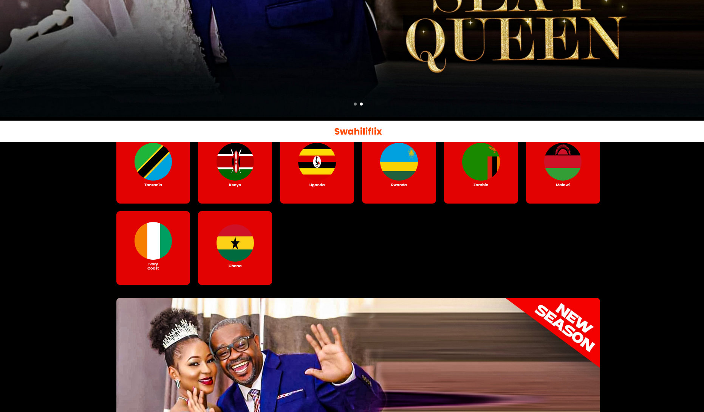
										<h6>Swahiliflix Pay ( DPO Integration ) </h6>
									

								</a>
							

						

						<!-- work single item  -->
						

							

								<a class="zoom-image" href="img/swahiliflix.png">
									

										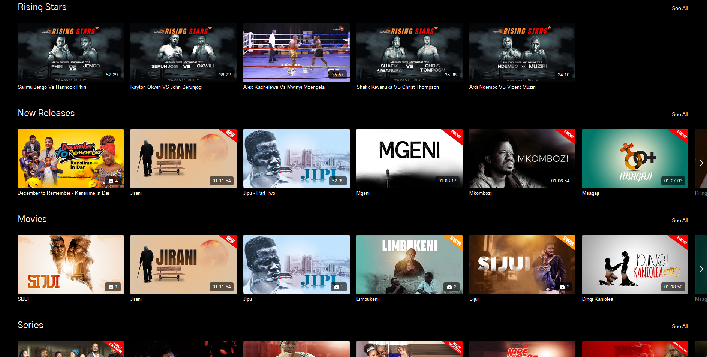
										<h6>Swahiliflix.tv</h6>
									

								</a>
							

						

						<!-- work single item  -->
						

							

								<a class="zoom-image" href="img/music.png">
									

										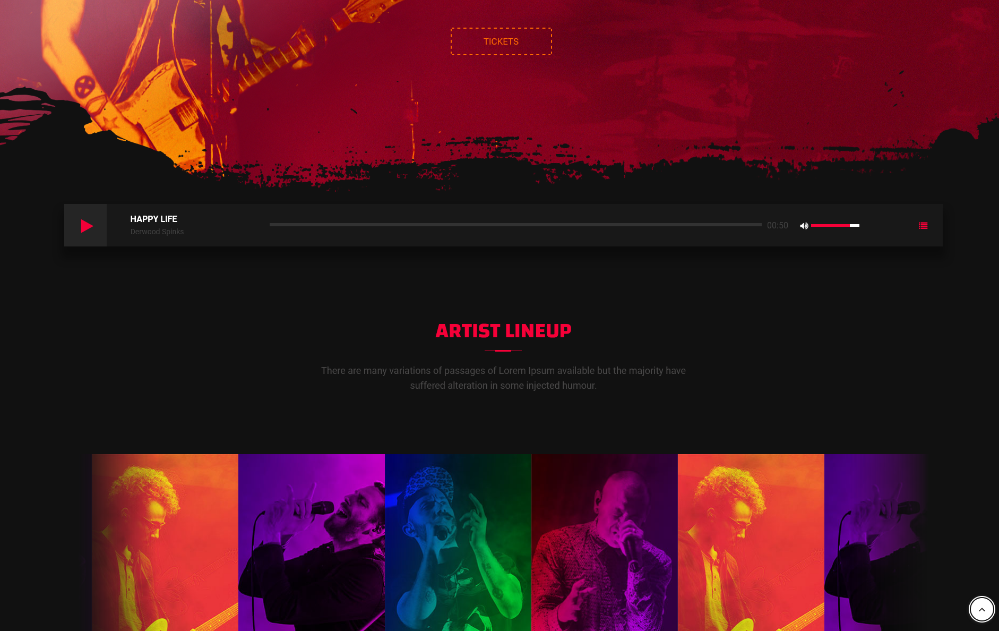
										<h6>Online Music Platform Event bookings and Ticket</h6>
									

								</a>
							

						

						
						

							

								<a class="zoom-image" href="img/security.png">
									

										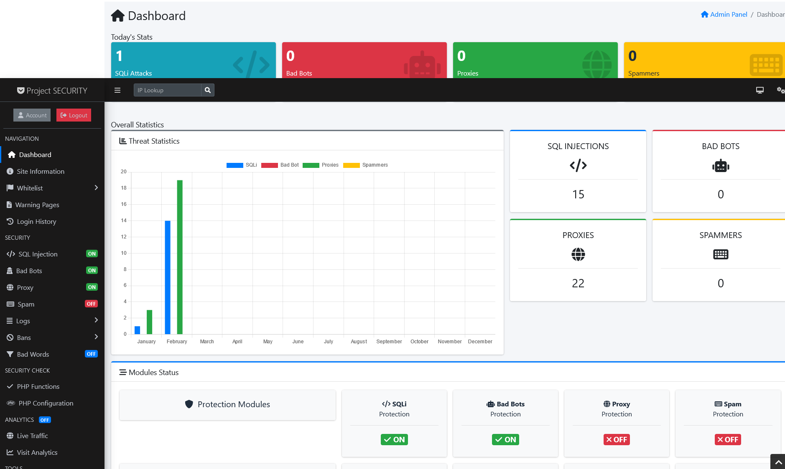
										<h6>Web Security & Firewall</h6>
									

								</a>
							

						

						
						
						

							

								<a class="zoom-image" href="img/advocate.png">
									

										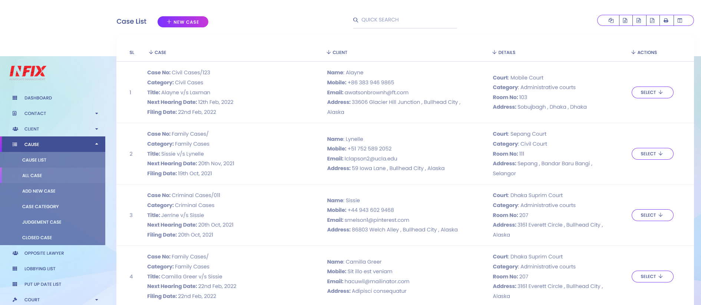
										<h6>Advocacy Office Management Sysyem</h6>
									

								</a>
							

						

						
						

							

								<a class="zoom-image" href="img/pos.png">
									

										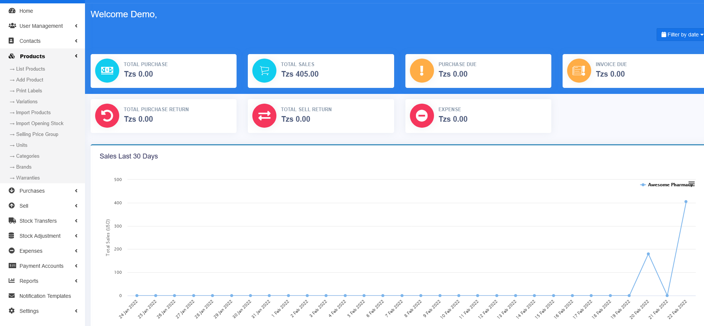
										<h6>Point Of Sell & Stock Management System for Shops, Pharmacy, Supermarkets etc...</h6>
									

								</a>
							

						

						
						<!-- work single item  -->
						

							

								<a class="zoom-image" href="img/roftz.png">
									

										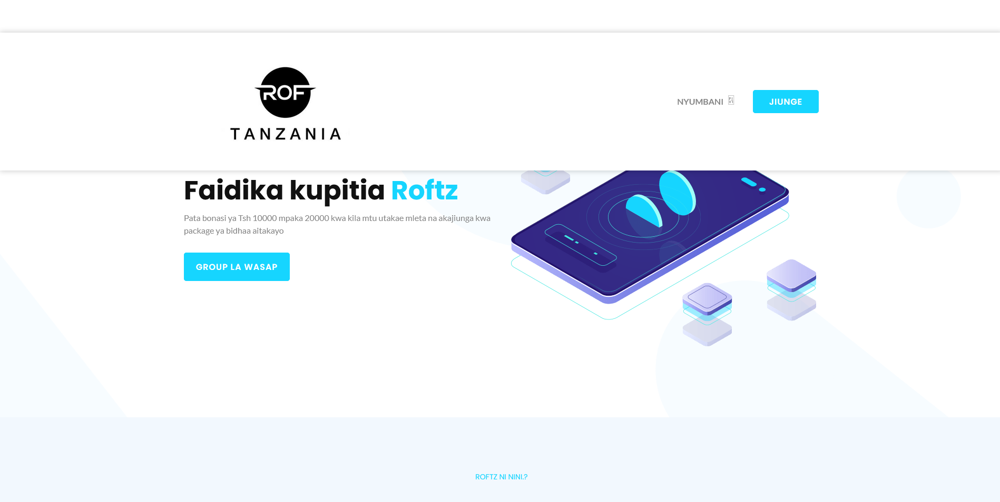
										<h6>roftz.com</h6>
									

								</a>
							

						

						
							

							

								<a class="zoom-image" href="img/harmony.png">
									

										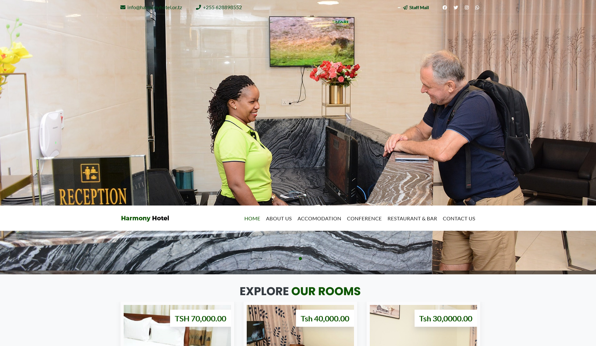
										<h6>harmonyhotel.co.tz</h6>
									

								</a>
							

						

						<!-- work single item  -->
						

							

								<a class="zoom-image" href="img/booking.png">
									

										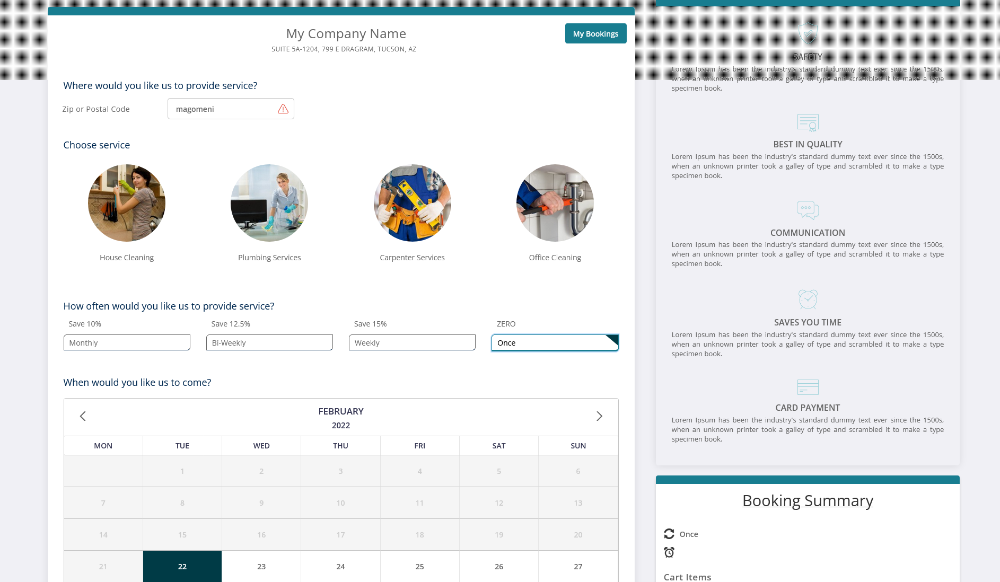
										<h6>Online Company Booking Management System for maids & Services</h6>
									

								</a>
							

						

						
						

							

								<a class="zoom-image" href="img/project.png">
									

										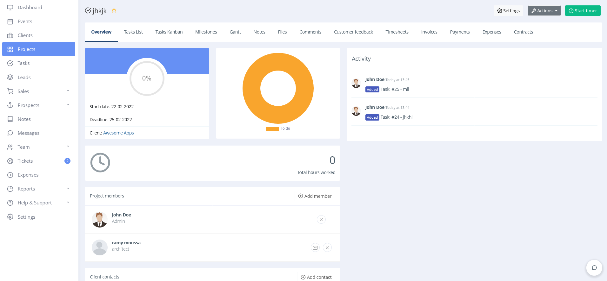
										<h6>Online Project manager management system - For project managers</h6>
									

								</a>
							

						

						<!-- work single item  -->
						

							

								<a class="zoom-image" href="img/swahiliflixx.png">
									

										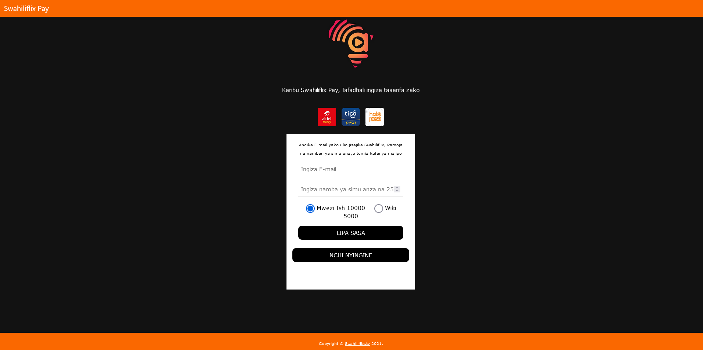
										<h6>Swahiliflix Pay ( Selcom Integration)</h6>
									

								</a>
							

						

						
						

							

								<a class="zoom-image" href="img/roftzz.png">
									

										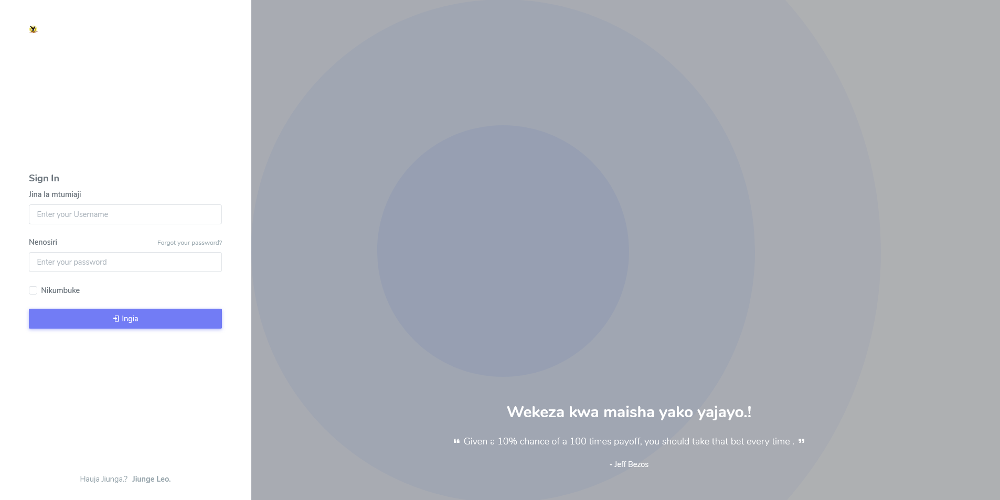
										<h6>roftz.com/sys </h6>
									

								</a>
							

						

						<!-- view all work button  -->
						

							<a href="#" class="default-btn all-work-btn">View All Works</a>
						

					

				

			

			<!-- end of works-wrapper -->

			<!-- begin of clients-wrapper -->
			<!-- 

				

					

						

							<!-- section heading
							<h3 class="wrapper-heading">Clients</h3>
						

						

							

								

								

								

								

								

								

								

							

						

					

				

			
 -->
			<!-- end of clients-wrapper -->

			<!-- begin of blogs-wrapper -->
			
			<!-- end of blogs-wrapper -->

			<!-- begin of contact-wrapper -->
			

				

					

						

							

								<h4>Get in Touch</h4>
								
Interested With My Products.? Let's get started today..

							

							

								
allyndimbo63@gmail.com

								
+255 684 049 052

								
Dar Es Salaam, Tanzania

								
<a href="https://wa.me/+255684049052">Whatsapp Message</a>

							

						

						

							<!--<form id="contact-form" action="">
                                

                                    

                                        

                                    

                                

                                

                                    

                                        <!-- input field for NAME
                                        <input class="input_field required" type="text" name="name" placeholder="Name">
                                        <!-- input field for EMAIL -
                                        <input class="input_field required" type="email" name="email" placeholder="Email">
                                    

                                    

                                        <!-- input field for MESSAGE
                                        <textarea class="input_field required" name="message" placeholder="Tell Me About Your Query."></textarea>
                                    

                                

                                

                                    

                                        <!-- button for MESSAGE-SEND 
                                        <button class="default-btn w-100" type="submit">Send Message</button>
                                    

                                    
	                                

	                                

                                

                            </form> -->
						

					

				

			

			<!-- end of contact-wrapper -->

			<!-- begin of contact-wrapper -->
			<footer class="wrapper footer-wrapper">
				

					

						

							<a href="https://twitter.com/ally_ndimbo" target="_blank">Twitter</a>
							<a href="https://instagram.com/ally_ndimbo" target="_blank">Instagram</a>
							<a href="https://linkedin.com/in/ally-ndimbo-806632127" target="_blank">Linkedin</a>
							<a href="https://www.facebook.com/ally.jamaly.71" target="_blank">Facebook</a>
							<a href="https://wa.me/+255684049052" target="_blank">Whatsapp</a>

						

						
© Copyright - <a href="" target="_blank">Ally Ndimbo</a>

					

				

			</footer>
			<!-- end of contact-wrapper -->

			<!-- scroll-to top -->
			<a class="default-btn scroll-to-top" href="#body"></a>

		

		<!-- end of main-content -->
    

    <!-- end of main-wrapper -->

    <!-- All JS -->
    
    
    
    

</body>

</html>
